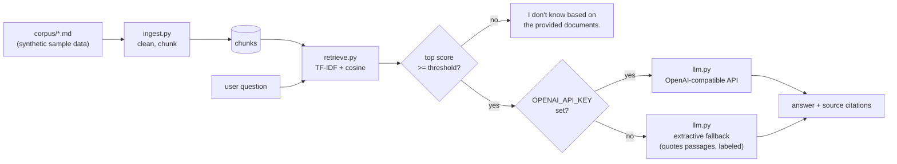

# AI Knowledge Assistant (RAG demo)

> **Self-directed demonstration — not client work.** Built to show how a
> retrieval-augmented Q&A assistant works end to end. No clients, no business
> results, no production claims.

## Problem

Small teams sit on piles of internal docs (handbooks, FAQs, runbooks) that
nobody reads. A knowledge assistant that answers questions *from those docs* —
with citations, and an honest "I don't know" when the answer isn't there —
is more useful than a generic chatbot that invents answers.

## Audience

Anyone evaluating whether retrieval-augmented generation fits their docs:
founders, ops managers, and developers scoping an internal support bot.

## Architecture



- **Ingestion** (`assistant/ingest.py`): strips the synthetic-data notices,
  splits documents into paragraphs, merges them into word-bounded chunks with
  paragraph overlap.
- **Retrieval** (`assistant/retrieve.py`): scikit-learn TF-IDF (1–2 grams)
  with cosine similarity. No external services; runs fully offline.
- **Answering** (`assistant/answer.py`): checks the top retrieval score
  against a documented threshold. Below it, the assistant abstains rather
  than guessing.
- **Generation** (`assistant/llm.py`): pluggable. With `OPENAI_API_KEY` set,
  an OpenAI-compatible chat API generates the answer from the retrieved
  context (stdlib `urllib` only). Without it, a clearly-labeled **extractive
  fallback** quotes the top passage — never presented as LLM output.

## Setup

```bash
cd ai-knowledge-assistant
python3 -m venv .venv && source .venv/bin/activate
pip install -r requirements.txt
```

No API key is required. Everything except the optional LLM adapter runs
offline.

## Run the demo

```bash
python -m assistant "When are fire drills held?"
python -m assistant "What is the company's stock price?"   # -> I don't know
python -m assistant "What is the password policy?" --json  # machine-readable
```

Optional LLM mode:

```bash
export OPENAI_API_KEY="sk-..."          # any OpenAI-compatible endpoint
export OPENAI_BASE_URL="https://api.openai.com/v1"  # override if self-hosted
export OPENAI_MODEL="gpt-4o-mini"
python -m assistant "How many vacation days do new employees get?"
```

## Run the evaluation

```bash
python eval/run_eval.py
```

`eval/questions.json` holds 10 question/answer pairs (7 answerable, 3
unanswerable). The runner reports PASS/FAIL per question and an overall
score. The pass criteria are heuristic keyword checks on a tiny synthetic
set — they measure retrieval and abstention behavior, not production
quality.

## Run the tests

```bash
pytest -q
```

Covers: corpus loading, retrieval returning the right document, abstention
on unanswerable questions, citations on answers, honest extractive labeling,
and the eval script executing end to end.

## Trade-offs and honest limitations

- **TF-IDF, not embeddings.** Chosen deliberately: zero dependencies beyond
  scikit-learn, fully offline, deterministic, and explainable. It handles
  keyword-style questions well and paraphrases poorly. A production version
  would use dense embeddings (and ideally hybrid search).
- **Tiny synthetic corpus.** Four hand-written docs. Real deployments need
  real ingestion pipelines (PDFs, Confluence, access control).
- **Extractive fallback is not an LLM.** Without an API key, answers are
  quoted passages, not synthesized responses. The output says so explicitly.
- **Eval is heuristic.** Keyword matching on 10 questions is a smoke test,
  not a benchmark. It cannot prove answer quality in general.
- **No access control or PII handling.** A real internal assistant must
  respect document permissions; this demo has none.
- **Threshold is tuned to this corpus** (`ASSISTANT_THRESHOLD`, default
  0.18). Different corpora need re-tuning; set it via environment variable.

## Project layout

```
corpus/                 synthetic sample documents + DATA_NOTE.md
assistant/
  __main__.py           CLI entry point
  ingest.py             loading + chunking
  retrieve.py           TF-IDF retrieval
  llm.py                optional LLM adapter + extractive fallback
  answer.py             orchestration, citations, abstention
  config.py             settings (env-overridable)
eval/
  questions.json        10 evaluation Q&A pairs
  run_eval.py           evaluation runner
tests/
  test_assistant.py     pytest suite
```
